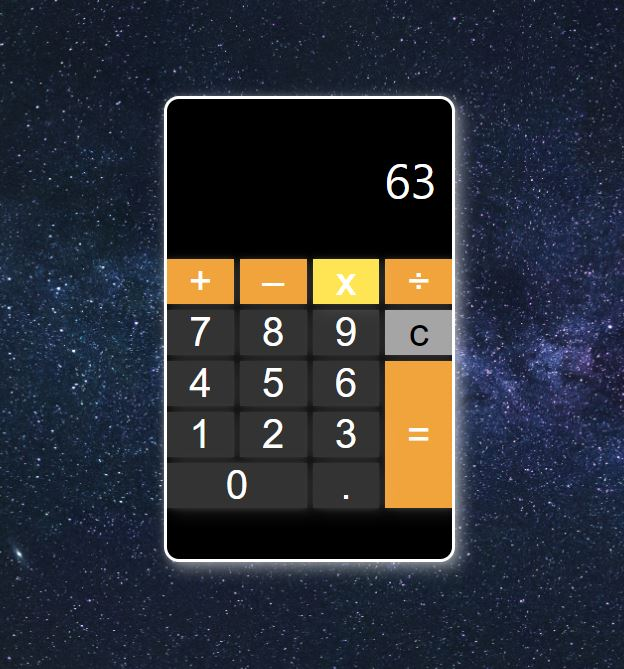

# 🎈 계산기 만들기

## 🎯 기능 요구사항

- 사용자의 입력 값에 따라 사칙연산을 계산할 수 있는 계산기이다.

 

## 🚀 To Do

- [ ] To Do 작성하기.
- [ ] HTML 계산기 뼈대 구성하기
- [ ] 사용자가 클릭할 버튼에 대한 리스너 구현
  - [ ] 숫자 버튼
  - [ ] 초기화 버튼
  - [ ] 사칙연산 버튼
  - [ ] 결과 버튼
  - [ ] decimal 버튼
- [ ] 사용자가 버튼을 클릭할때 수행되는 작업 구현하기.
  - [ ] 숫자 버튼: 숫자가 입력되었을 때
  - [ ] 초기화 버튼: 모든 값을 초기화
  - [ ] 사칙연산 버튼: 숫자가 입력된 상태일 때만 가능
  - [ ] 결과 버튼: 입력된 값의 사칙연산 수행
  - [ ] decimal 버튼: 소수점변경

## 🔖 결과물
 

