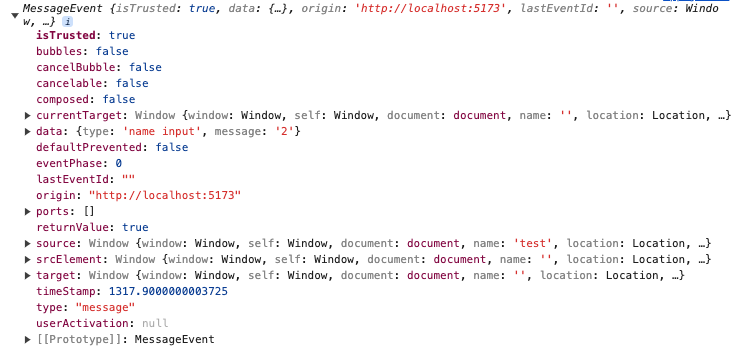

## window.postMessage:

window object 사이에서 안전하게 cross-origin을 통신 수 있게 하는 메서드로
페이지와 팝업 간의 통신, 페이지와 페이지 안의 iframe 사이의 통신에 사용될 수 있다.

## 문법:

```javascript
targetWindow.postMessage(message, targetOrigin);
```

- targetWindow: 메시지를 전송할 창의 참조

  - window.open (새 창을 만들고 새 창을 참조할때)
  - window.opener (새 창을 만든 window를 참조 할 때)

- message: 전송할 메시지, 이는 문자열, 숫자, 객체 등 다양한 형식이 가능

- targetOrigin (선택 사항): 메시지를 전송할 창의 URL로 보안상의 이유로 명시해주는 것이 좋다. 이 값이 '\*'인 경우는 모든 창으로 메시지를 전송이 가능

### 부모가 자식의 데이터를 수신하는 방법

부모 쪽에서 'message' 이벤트 핸들러를 등록하여 메시지를 받아 처리할 수 있다.

```javascript
useEffect(() => {
  const childResponse = (event) => {
    const message = event?.data?.message;

    setMessage(message);
  };
  window.addEventListener("message", childResponse);
  return () => window.removeEventListener("message", childResponse);
}, []);
```

'message' 이벤트 핸들러의 event 프로퍼티에는
message emitter의 data,
message emitter의 출처인 origin
message emitter의 window객체의 참조인 source로 구성되어 있다.

 <p align="center"></p>
